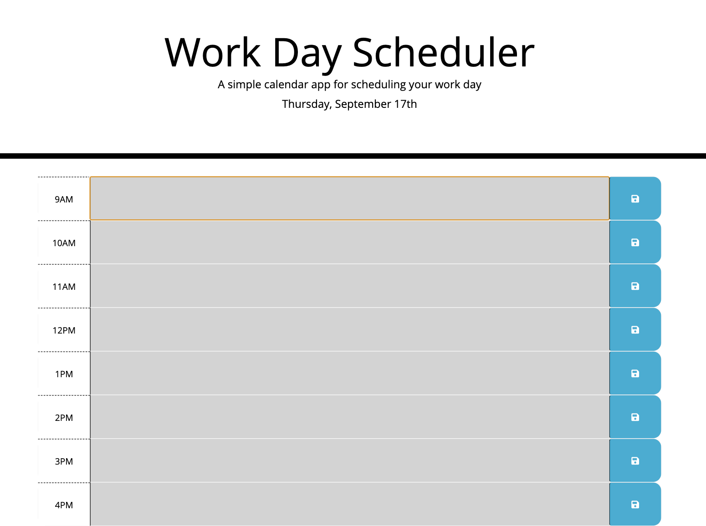

# Work-day-Scheduler

This application is a calender that allows the user to save events in each hour of the day. 

## Contents 

This application is composed of 3 pages, index.html, style.css and script.js. It also has the screenshots used for the README file in the images folder. 

## User Story 

AS AN employee with a busy schedule 
I WANT to add important events to a daily planner 
SO THAT I can manage my time effectively

## Built With 

* VS Code (https://code.visualstudio.com/)
* Terminal

## Screenshots 

## License 

This application does not have a license. 

## Link to the app

<a href="https://chloeblackwell.github.io/Work-day-Scheduler/">Link to the app</a>

## Author 

Chloe Blackwell 
Email: chloeblackwell2@hotmail.com
